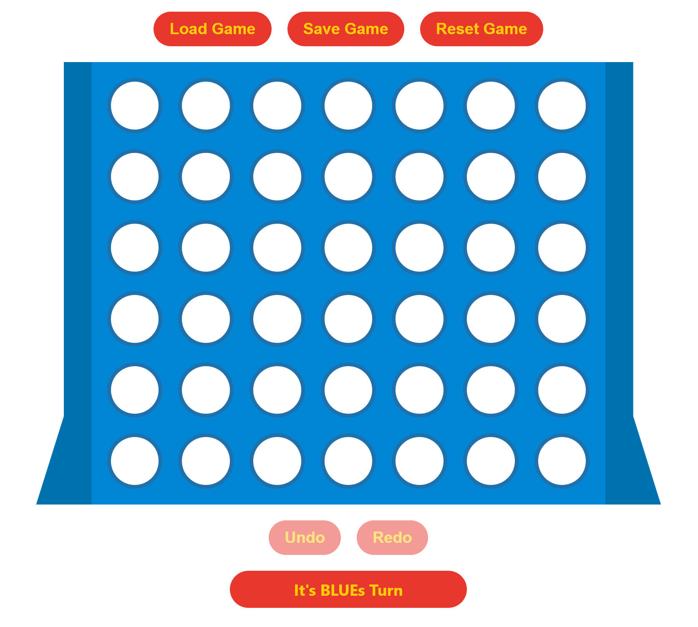

## Connect4
### Team
- Annie Hemprich (hemprann@students.zhaw.ch)

### Implementationsdetails
- Verwendete Node-Module: react und gh-pages
- Build in separaten Branch commited
- React-Komponenten (ohne SJDON)
- Zustandsverwaltung mit setState
- Undo/Redo Funktionalität mit setState
- Persistenz in LocalStorage
- Klasse Board beinhaltet Board-spezifische Funktionen

### Funktionsübersicht
- Board.getWinner berechnet, ob ein Spieler gewonnen hat
- Board.getTurn berechnet, welche Spieler an der Reihe ist (Blau beginnt)
- Board.play setzt wenn möglich einen Stein in der angegebenen Zeile
- Board.save gibt die zu speichernden Daten zurück
- new Board: Daten zur Initialisierung können mitgegeben werden 
- OnClick Handler: In der Komponente App zu finden
- Undo/Redo Handler: In der Komponente App zu finden

### Link
https://avvvvvvie.github.io/connect4/

### Screenshot
